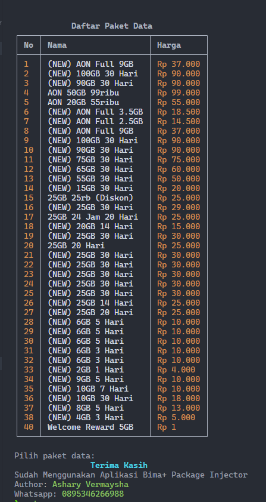

# Bima+ Package Injector (FREE)

Sebuah aplikasi sederhana dan bebas yang dapat digunakan untuk mendaftarkan paket data kartu tri.

# Requirement

1. `NodeJS >= v16`
2. `Git`

Sangat disarankan untuk menginstall nodejs menggunakan [NVM](https://github.com/nvm-sh/nvm).  
Bagi pengguna android dapat menggunakan termux tetapi **hindari instalasi dari Google Play** karena sudah **outdated**, kamu bisa menginstall menggunakan [F-Droid](https://f-droid.org) atau langsung mendownload dari link berikut [https://f-droid.org/repo/com.termux_118.apk](https://f-droid.org/repo/com.termux_118.apk)

# Android Usage (Termux F-Droid)

1. `pkg update -y`
2. `pkg install nodejs-lts -y`
3. `pkg install git -y`

Dan lanjutkan menjalankan perintah selanjutnya.

# Install from source

1. `git clone https://github.com/vermaysha/bima-plus.git`
2. `cd bima-plus`
3. `npm ci`
4. `npm run build`
5. `npm run start`

# Upgrading

1. `git pull`
2. `npm ci`
3. `npm run build`
4. `npm run start`

# Quick Installation

Apabila kamu tidak ingin menggunakan step diatas, kamu bisa langsung menggunakan cara yang tercantum pada halaman ini [Latest Release](https://github.com/vermaysha/bima-plus/releases/latest)

# Preview

# LICENSE

Copyright 2022 Ashary Vermaysha

Permission is hereby granted, free of charge, to any person obtaining a copy of this software and associated documentation files (the "Software"), to deal in the Software without restriction, including without limitation the rights to use, copy, modify, merge, publish, distribute, sublicense, and/or sell copies of the Software, and to permit persons to whom the Software is furnished to do so, subject to the following conditions:

The above copyright notice and this permission notice shall be included in all copies or substantial portions of the Software.

THE SOFTWARE IS PROVIDED "AS IS", WITHOUT WARRANTY OF ANY KIND, EXPRESS OR IMPLIED, INCLUDING BUT NOT LIMITED TO THE WARRANTIES OF MERCHANTABILITY, FITNESS FOR A PARTICULAR PURPOSE AND NONINFRINGEMENT. IN NO EVENT SHALL THE AUTHORS OR COPYRIGHT HOLDERS BE LIABLE FOR ANY CLAIM, DAMAGES OR OTHER LIABILITY, WHETHER IN AN ACTION OF CONTRACT, TORT OR OTHERWISE, ARISING FROM, OUT OF OR IN CONNECTION WITH THE SOFTWARE OR THE USE OR OTHER DEALINGS IN THE SOFTWARE.
